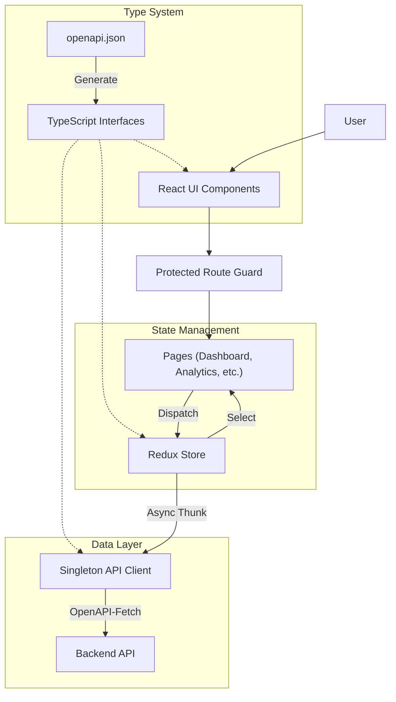
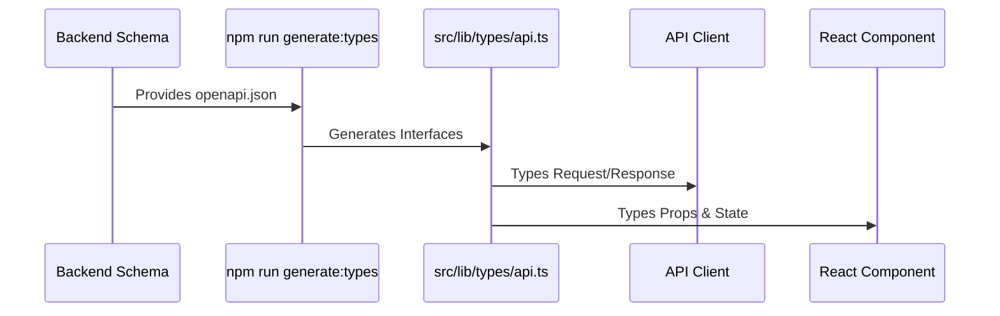
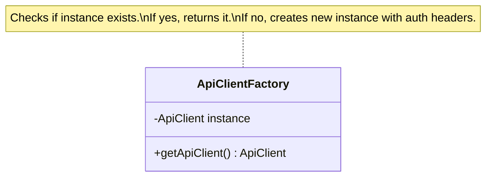

# Nexus Frontend Architecture

This document provides a comprehensive overview of the architectural choices, design patterns, and structure of the Nexus frontend application.

## 1. Architectural Overview

The application is built as a Single Page Application (SPA) using React, styled with Tailwind CSS, and powered by Redux Toolkit for state management. It communicates with a backend API using a typed OpenAPI client.



## 2. Key Architectural Choices

### 2.1 OpenAPI & Type Safety

We leverage the OpenAPI specification to ensure end-to-end type safety. Instead of manually defining interfaces, we generate them directly from the backend schema.

*   **Tools**: `openapi-typescript` for generation, `openapi-fetch` for the runtime client.
*   **Workflow**:
    1.  Backend provides `openapi.json`.
    2.  `npm run generate:types` converts schema to TypeScript interfaces (`src/lib/types/api.ts`).
    3.  The API client uses these types to enforce request/response structures.



### 2.2 API Client (Singleton Pattern)

The API client is implemented as a **Singleton** to ensure a single, consistent configuration instance throughout the application lifecycle. This centralized approach handles:
*   Base URL configuration.
*   Automatic injection of Authentication Tokens (JWT) from LocalStorage.
*   Consistent error handling.

**File**: `src/lib/api-client.ts`



### 2.3 State Management (Redux Toolkit)

We use **Redux Toolkit (RTK)** to manage global application state. This avoids "prop drilling" and ensures a predictable state container.

*   **Slices**: Modular state bundles (e.g., `teamsSlice`, `analyticsSlice`).
*   **Async Thunks**: Handles asynchronous API logic (`fetchAnalytics`, `loginUser`).
*   **Selectors**: derived state for components.

**Pattern**:
1.  **Component** dispatches a Thunk.
2.  **Thunk** calls the **API Client**.
3.  **API Client** returns data.
4.  **Slice** updates the state (loading, success, error).
5.  **Component** re-renders via Selector.

### 2.4 Single Responsibility Principle (SRP)

The codebase is structured to adhere to SRP, ensuring each module has one distinct reason to change.

*   **`src/components/protected-route.tsx`**: Responsible **only** for checking authentication status and redirecting. It doesn't know about page content.
*   **`src/lib/auth-actions.ts`**: Responsible **only** for the business logic of logging in/out (API calls + Token storage). It doesn't render UI.
*   **`src/lib/api-client.ts`**: Responsible **only** for HTTP communication configuration.
*   **`src/pages/*`**: Responsible for layout and connecting data to components.
*   **`src/components/*-content.tsx`**: Responsible for presenting data (Presentational Components).

## 3. Folder Structure

The project follows a feature-first and functional categorization:

```
src/
├── components/          # Reusable UI components
│   ├── ui/              # Shadcn/UI primitive components (Button, Card, etc.)
│   ├── app-navbar.tsx   # Global navigation
│   ├── protected-route.tsx # Auth guard component
│   └── *-content.tsx    # Feature-specific presentational components
├── lib/                 # Utilities and core logic
│   ├── types/           # Generated TypeScript definitions
│   ├── api-client.ts    # Singleton API client
│   ├── auth-actions.ts  # Auth business logic
│   └── utils.ts         # Helper functions
├── pages/               # Route views (Container components)
│   ├── Dashboard.tsx
│   ├── Analytics.tsx
│   └── ...
├── store/               # Redux State Management
│   └── index.ts         # Store configuration, slices, and thunks
├── App.tsx              # Main routing configuration
└── main.tsx             # Entry point & Providers
```

## 4. Documentation & Maintenance

*   **Adding a new feature**:
    1.  Update `openapi.json` (if backend changes) and run `npm run generate:types`.
    2.  Create/Update Redux Slice & Thunks in `src/store`.
    3.  Create Presentational Component in `src/components`.
    4.  Create Page Component in `src/pages`.
    5.  Add route in `App.tsx`.
